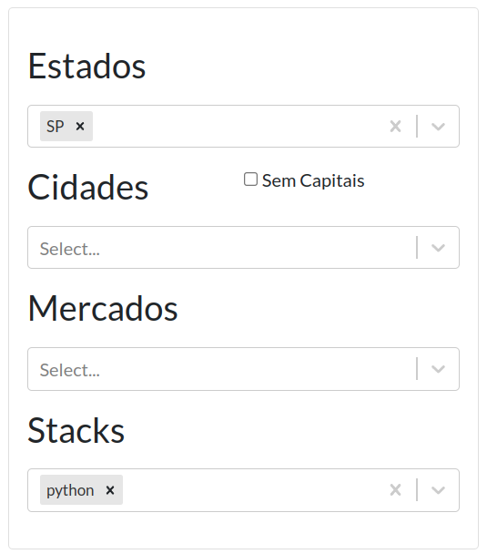
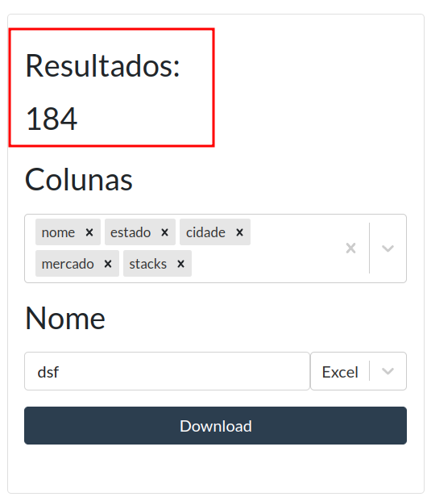
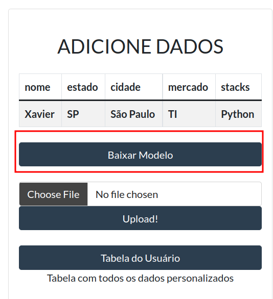
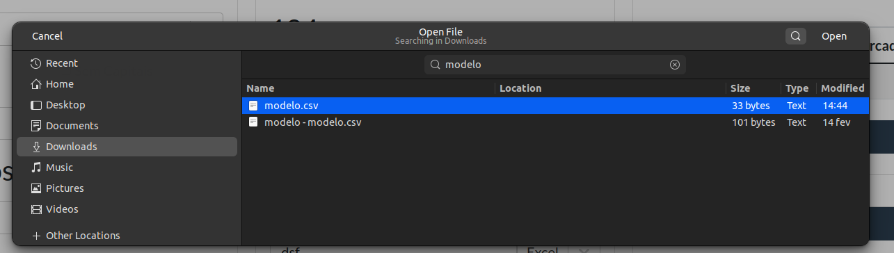
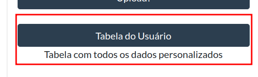

# Xavier  

## Overview  
Xavier é um aplicativo capaz de fornecer vários dados sobre empresa e suas stacks, mercados e localização com intuito de facilitar o processo de hunting feito por equipes de recrutamento.  

## Requisitos  
1. Criar um bucket na aws s3.  
2. Criar um banco de dados do tipo PostgreSQL.  
3. Colocar as credenciais das contas seguindo o modelo template_environments_variables.txt e salvando em arquivo .env  

## Como usar  
Clone o repositório.

### Colete os dados  

Vá para a pasta data_lake/data_sources e mude os env_file para o arquivo .env com as credenciais da AWS. Além disso, deve-se alterar a variável DESTINATION de cada um dos serviços do docker-compose, para o destino do arquivo parquet no S3.
Então, digite no terminal:  
```sh
docker-compose up
```  
Após terminar de pegar os dados, vá para pasta data_lake/data_transform e escreva no terminal:
```sh
docker build -t xavier
docker run --rm --env-file <path-to-credentials> xavier
```  

### Iniciar o aplicativo  

Vá para a pasta api e escreva no terminal:  
```sh
docker-compose up
```  
Agora a aplicação está rodando no localhost:3000  

## Usar o aplicativo  
### Pesquisa   

Ao entrar na aplicação, preencha os dados que deseja buscar no primeiro card.  

  

A quantidade de dados gerados vai aparecer no topo do segundo card.  

  

Agora, escolha as colunas e o nome e clique em download.  

### Adicione dados

No terceiro card da aplicação, é possível baixar o modelo de tabela para adicionar dados. Logo acima, há um exemplo de como os dados devem ser inseridos no arquivo.

  

Baixe o modelo e coloque os dados como o exemplo.

  

Clique em **Choose File** (Escolha Arquivo) e escolha um arquivo. 

  

Agora é só enviar clicando em **Upload**.  

Você também pode ver dados que já foram enviados em **Tabela do Usuario**.  

  

## Sobre os dados  

O xavier eh uma aplicacao que coleta dados de sites de empresas e stacks usando webscrapping como tecnica principal. As fontes de dados sao Startupbase, Slintel, Coodesh e Programathor.

As principais informações que são apresentadas pelo programa são de localização, área de atuação e stacks das empresas encontradas. Com essas informações, acreditamos que recrutadores podem conseguir encontrar empresas que (deem match) com vagas que estão procurando. Além disso, para algumas empresas, ainda é possível obter algumas informações adicionais, tais como website e tamanho.

Após conseguir os dados, eles são salvos em buckets S3 da AWS em formato parquet. Então eles são normalizados (retirando caracteres especiais e passando para caixa baixa) e são retiradas as informações duplicadas, para serem enviados para um banco de dados PostgreSQL.

Exemplo  

|nome|estado|cidade|mercado|stacks|
|--|--|--|--|--|
|nubank|sp|sao paulo|financas|nginx, python...|
|glucogear|sp|sao paulo|saude e bem-estar|google cloud cdn...|
|...|...|...|...|...|

